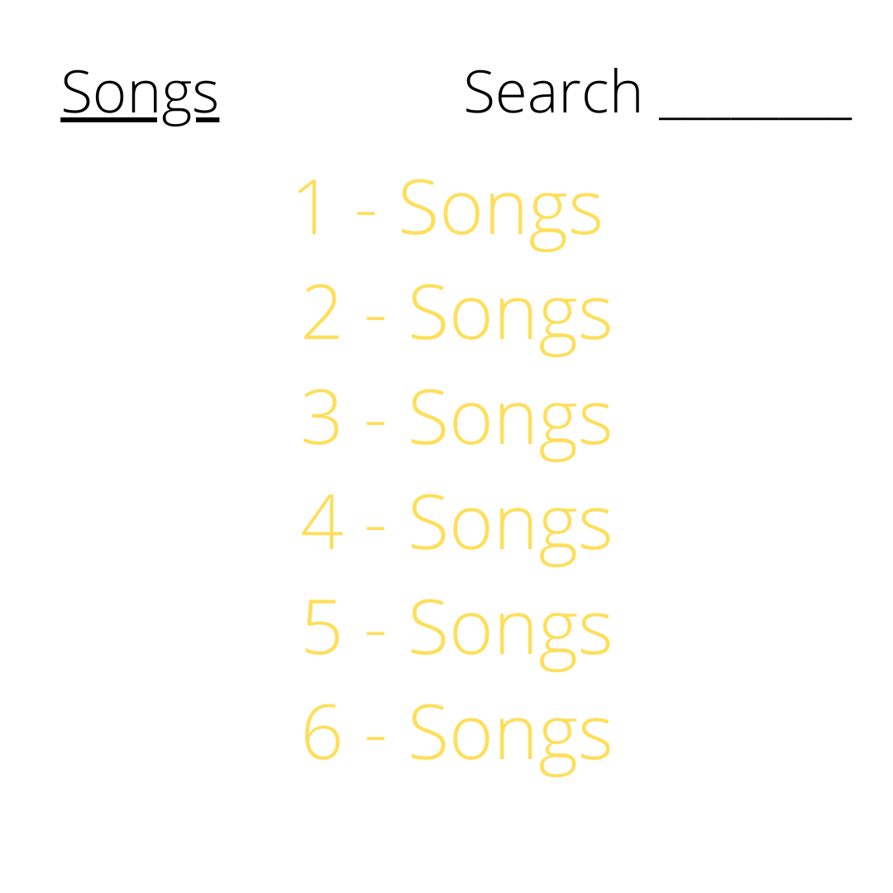
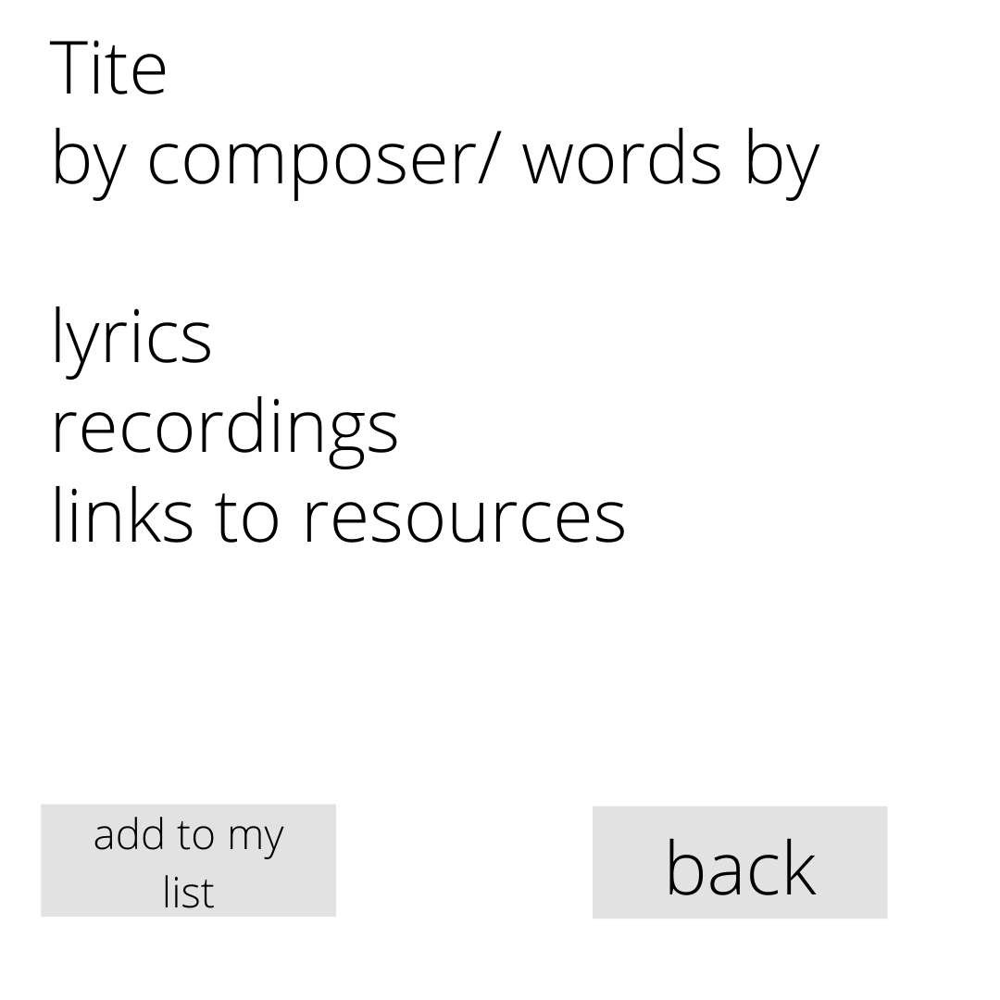

# HARMONY HAVEN README

## Deployed Link
Deployed on Heroku (Client) 
https://harmonyhavenclient.herokuapp.com/

## Link to backend api
GitHub API Repo https://github.com/bostonbachexchange/project_4_API

## Pitch
HARMONY HAVEN is an app that will take your choir to the next level. 

## Premise
This platform allows choir members to connect to other members in their chorus. Users find choral works to practice and add to their repertoire list. Create an opportunity to connect and share ideas and build community. Users create profiles and add music to their available repertoire list. Users will be able to create profiles, log in, and view all available repertoire, and sign up for themselves. Excellence and artistry is right around the corner.

## User Stories
### As a user (chorus/community member)…
* As a user, I want to be able to create a user account/sign up
* As a user, I want to be able to sign in to my user account 
* As a user, I want to be able to change my user password 
* As a user, I want to be able to sign out of my user account
* As a user, I want to be able to view my user information
* As a user, I want to see all songs/hymns
* As a user, I want to be able to select ONE hymn/repertoire piece and view it by itself
* As a user, I want to add/delete my song list
* As a user, I want to be see message board post and to select ONE post and view it by itself

## STRETCH GOALS…
* As a user, I want to be able to search ALL music/repertoire through a search bar
* As a user, I want to add images to my profile
* As a user, I want to be able to leave comments on the message board (subdocument)

#### As an admin user…
* As an admin, I want to see all user profiles and view one by itself 
* As an admin, I want to be able to add/delete repertoire instead of user

## Wireframes

LAYOUT VIEW - overview

LAYOUT-2 VIEW - overview

Log In/Sign Up

Sign Up

Songs INDEX - logged in

Show Song

MY Songs Index

Message Board Index

Message Board Show

Message Board Edit 

ERD

